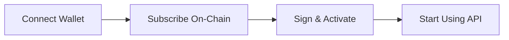

## Start Building with Free World Cup Data

Experience the power of TxLINE's real-time sports data API with our complimentary free tier. Get instant access to EPL and World Cup data with no payment required, no credit card needed, and no commitment.

## Why Choose TxLINE Free Tier?

<CardGroup cols={2}>
  <Card title="Zero Cost" icon="circle-dollar">
    Completely free access to EPL and World Cup data. No hidden fees, no trial limitations.
  </Card>
  <Card title="Production Ready" icon="rocket">
    Same reliable infrastructure as our premium tiers. 
  </Card>
  <Card title="Frictionless Integration" icon="code">
    Simple API integration with comprehensive documentation and code examples.
  </Card>
  <Card title="Historical Access" icon="clock-rotate-left">
    Full access to historical data replay for past matches and events.
  </Card>
</CardGroup>

## What's Included

The free tier gives you access to:

- **EPL (English Premier League)** 
- **World Cup**
- **Historical Replay** 
- **Unlimited API Calls** 
- **On-Chain Verification** 

<Info>
**Perfect For**: Developers building proof-of-concepts, hobbyist projects, learning platforms, or testing TxLINE before upgrading to real-time data.
</Info>

## How It Works

TxLINE uses Solana blockchain for transparent subscription management. Even the free tier is registered on-chain, giving you verifiable access to our API.



## Getting Started

### Step 1: Set Up Your Solana Wallet

You'll need a Solana wallet to subscribe. If you don't have one:

```bash
npm install @solana/web3.js @coral-xyz/anchor
```

```typescript
import * as anchor from "@coral-xyz/anchor";
import { Connection, Keypair } from "@solana/web3.js";

// Set up your connection
const connection = new Connection("https://api.mainnet-beta.solana.com");
const provider = new anchor.AnchorProvider(
  connection,
  wallet,
  { commitment: "confirmed" }
);
```

### Step 2: Subscribe to Free Tier

Subscribe to service level ID 0 for free access. No TxL tokens required!

```typescript
import * as anchor from "@coral-xyz/anchor";
import { TOKEN_2022_PROGRAM_ID, ASSOCIATED_TOKEN_PROGRAM_ID } from "@solana/spl-token";
import { SystemProgram } from "@solana/web3.js";

// Free tier configuration
const SERVICE_LEVEL_ID = 0; // Free tier: EPL + World Cup
const DURATION_WEEKS = 1; // Subscribe for 1 week at a time
const SELECTED_LEAGUES: number[] = []; // Empty for standard bundle

// Subscribe on-chain
const txSig = await program.methods
  .subscribe(SERVICE_LEVEL_ID, DURATION_WEEKS)
  .accounts({
    user: provider.wallet.publicKey,
    pricingMatrix: pricingMatrixPda,
    tokenMint: SUBSCRIPTION_TOKEN_MINT,
    userTokenAccount: userTokenAccount.address,
    tokenTreasuryVault,
    tokenTreasuryPda,
    tokenProgram: TOKEN_2022_PROGRAM_ID,
    associatedTokenProgram: ASSOCIATED_TOKEN_PROGRAM_ID,
    systemProgram: SystemProgram.programId,
  })
  .rpc();

console.log("Subscription transaction:", txSig);
```

<Note>
**No Payment Required**: Since this is the free tier (ID 0), you won't be charged any TxL tokens. The transaction simply registers your subscription on-chain.
</Note>

### Step 3: Activate Your API Access

After subscribing on-chain, activate your API token by signing and calling our activation endpoint.

```typescript
import axios from "axios";
import nacl from "tweetnacl";

// Get guest authentication token
const authResponse = await axios.post(
  "https://txline.txodds.com/auth/guest/start"
);
const jwt = authResponse.data.token;

// Create message to sign
const messageString = `${txSig}:${SELECTED_LEAGUES.join(",")}:${jwt}`;
const message = new TextEncoder().encode(messageString);

// Sign with your wallet
const signatureBytes = nacl.sign.detached(
  message,
  provider.wallet.payer!.secretKey
);
const walletSignature = Buffer.from(signatureBytes).toString("base64");

// Activate your API access
const activationResponse = await axios.post(
  "https://txline.txodds.com/api/token/activate",
  {
    txSig,
    walletSignature,
    leagues: SELECTED_LEAGUES,
  },
  {
    headers: { Authorization: `Bearer ${jwt}` }
  }
);

// Save your API token
const apiToken = activationResponse.data.token || activationResponse.data;
console.log("API Token activated successfully!");
```

### Step 4: Make Your First API Call

You're all set! Start fetching World Cup and EPL data using your API token.

Check out the complete [API Reference](/api-reference/authentication/guest-start) for all available endpoints including:

- **Live Matches** - Get real-time match data and scores
- **League Standings** - Access current league tables and rankings
- **Historical Data** - Replay past matches and events
- **Player Statistics** - Detailed player performance metrics
- **Match Events** - Goals, cards, substitutions, and more

All endpoints require the `Authorization: Bearer ${apiToken}` header for authentication.

## Use Cases

### Fantasy Sports Platform
Build a fantasy sports platform with real-time EPL and World Cup data. Perfect for testing your concept before scaling.

### Sports Analytics Dashboard
Create data visualizations and analytics tools using historical match data and live scores.

### Educational Projects
Learn API integration and data processing with production-quality sports data.

### Proof of Concept
Validate your sports betting or prediction platform before investing in premium real-time data.

## Ready for More?

Love the free tier? Upgrade to unlock:

<CardGroup cols={3}>
  <Card title="Real-Time Data" icon="bolt">
    Zero delay live data for time-sensitive applications
  </Card>
  <Card title="100+ Leagues" icon="trophy">
    Access to all major leagues worldwide
  </Card>
  <Card title="Custom Leagues" icon="sliders">
    Choose exactly which leagues you need
  </Card>
</CardGroup>

View our [Subscription Tiers](/subscription-tiers) to see all available options, starting from just **116,667 TxL ($116.67) per week**.

## Support & Resources

- **API Reference**: [Complete API documentation](/api-reference/authentication/guest-start)
- **Full Quickstart**: [Premium tier setup guide](/quickstart)
- **Subscription Tiers**: [View all pricing options](/subscription-tiers)
- **Technical Support**: Contact us for integration assistance

## Frequently Asked Questions

<AccordionGroup>
  <Accordion title="Do I need to renew my free subscription?">
    Yes, free tier subscriptions are valid for 1 week at a time. Simply re-subscribe when your access expires. There's no cost to renew.
  </Accordion>

  <Accordion title="Can I upgrade from free tier to paid?">
    Absolutely! You can upgrade at any time by subscribing to a paid tier. Your new subscription will take effect immediately.
  </Accordion>

  <Accordion title="Is there a rate limit on free tier?">
    No rate limits on API calls. However, data has a 60-second delay compared to premium real-time tiers.
  </Accordion>

  <Accordion title="What happens if I don't renew?">
    Your API access will expire after the subscription period ends. You can re-subscribe at any time to regain access.
  </Accordion>

  <Accordion title="Can I use this for commercial projects?">
    Yes! The free tier can be used for commercial projects. However, for production applications, we recommend upgrading to real-time data for the best user experience.
  </Accordion>
</AccordionGroup>

---

<Info>
**Ready to start?** Follow the steps above to get your free API access in under 5 minutes. No credit card required.
</Info>
